# Design Document & Architecture Blueprint — Agentic Hyper Scalers

**The AI Cloud Command Centre**

| | |
|---|---|
| **Document** | Architecture & Design Document (ADD) |
| **Product** | Agentic Hyper Scalers — The AI Cloud Command Centre |
| **Version** | 1.0 |
| **Status** | Baselined |
| **Date** | 2026-06-14 |
| **Author** | Raghuram Nimishakavi |
| **Repository** | https://github.com/nimragram74/agentic-hyperscalers |
| **Live URL** | https://agentic-hyperscalers.vercel.app |
| **Related docs** | [Functional Specification](./FUNCTIONAL_SPECIFICATION.md) · [Design System](./design/style-guide.md) |

> Diagrams below are authored in **Mermaid** and render natively on GitHub. View this file on GitHub (or any Mermaid-aware Markdown viewer) to see the blueprints.

---

## 1. Architecture overview

Agentic Hyper Scalers is a **statically pre-rendered, content-driven Next.js application** following the **JAMstack** model: build-time data baking, a thin client layer for interactivity, and edge/CDN delivery via Vercel.

**Architectural principles**
1. **Static-first** — every route is pre-rendered at build time (SSG); no runtime database.
2. **Data as source of truth** — content lives in version-controlled CSV/JSON, parsed server-side at build.
3. **Server/Client split** — data access stays server-side; only interactive widgets are client components.
4. **Design-system enforced** — a single token set + a `design-enforcer` agent guarantee visual consistency.
5. **Zero-config deploy** — push to GitHub → Vercel auto-builds and ships to its global edge network.

### 1.1 Technology stack

| Layer | Choice | Rationale |
|---|---|---|
| Framework | **Next.js 14 (App Router)** | File-based routing, RSC, first-class SSG, Vercel-native. |
| Language | **TypeScript** (strict) | Type-safe data contracts end-to-end. |
| UI runtime | **React 18** | Server + Client Components. |
| Styling | **Tailwind CSS v3** | Token-driven utility styling; predictable, stable. |
| Animation | **Framer Motion** | Page transitions, scroll reveals, ambient motion. |
| Icons | **lucide-react** | Lightweight, consistent icon set. |
| Fonts | **next/font** (Space Grotesk, Inter) | Self-optimised, no layout shift. |
| Images | **next/image** + Pexels remote | Optimised, lazy-loaded remote imagery. |
| Hosting | **Vercel** | Auto-detect Next.js, global CDN, CI/CD on push. |
| SCM | **GitHub** | Source of truth; triggers deploys. |

---

## 2. System context (C4 — Level 1)

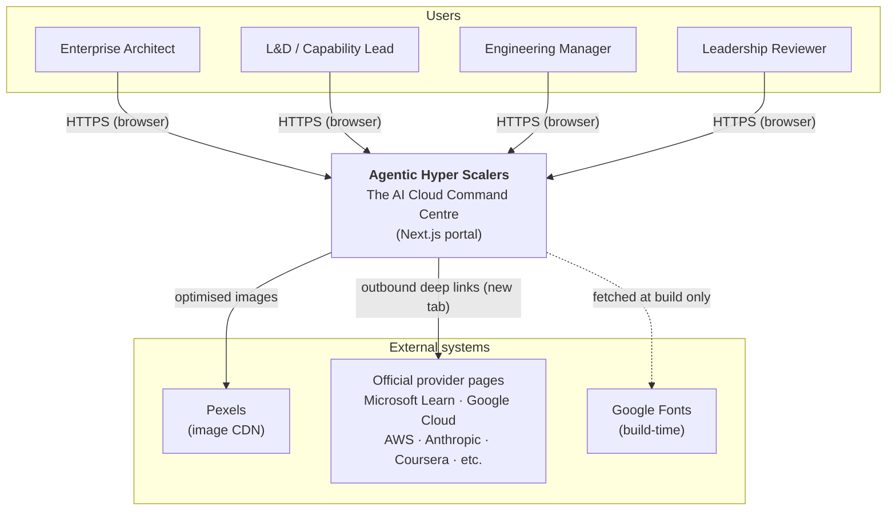

---

## 3. Container & deployment architecture (C4 — Level 2)

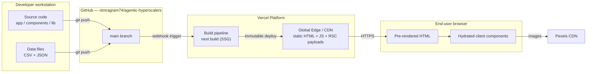

**Key point:** content (CSV/JSON) is read **only at build time** inside `next build`. The deployed artefact is pure static output — no server runtime reads the filesystem in production.

---

## 4. Component architecture (C4 — Level 3)

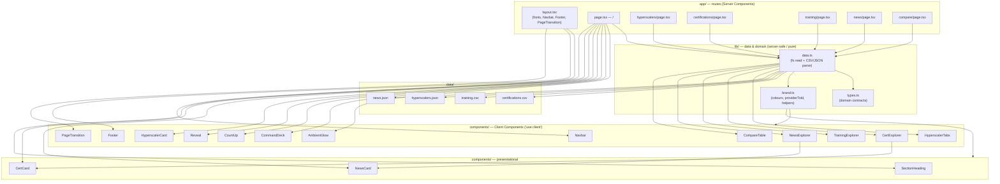

### 4.1 Server vs Client boundary

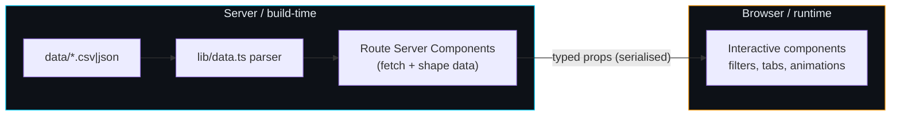

> **Design rule honoured:** `lib/data.ts` uses `node:fs`/`node:path` and must never be imported by a client component. The pure helper `providerToId` therefore lives in `lib/brand.ts`, which both layers may import safely.

---

## 5. Routing map

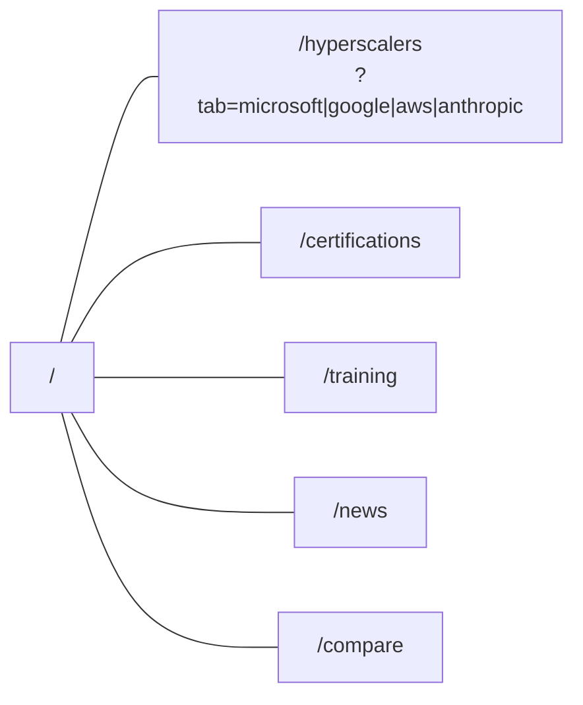

| Route | Render mode | Server data | Primary client widgets |
|---|---|---|---|
| `/` | SSG | all 4 datasets | AmbientGlow, CommandDeck, CountUp, HyperscalerCard |
| `/hyperscalers` | SSG | hyperscalers | HyperscalerTabs (reads `?tab`) |
| `/certifications` | SSG | certifications | CertExplorer → CertCard |
| `/training` | SSG | training | TrainingExplorer |
| `/news` | SSG | news | NewsExplorer → NewsCard |
| `/compare` | SSG | hyperscalers + certs | CompareTable |

---

## 6. Data model

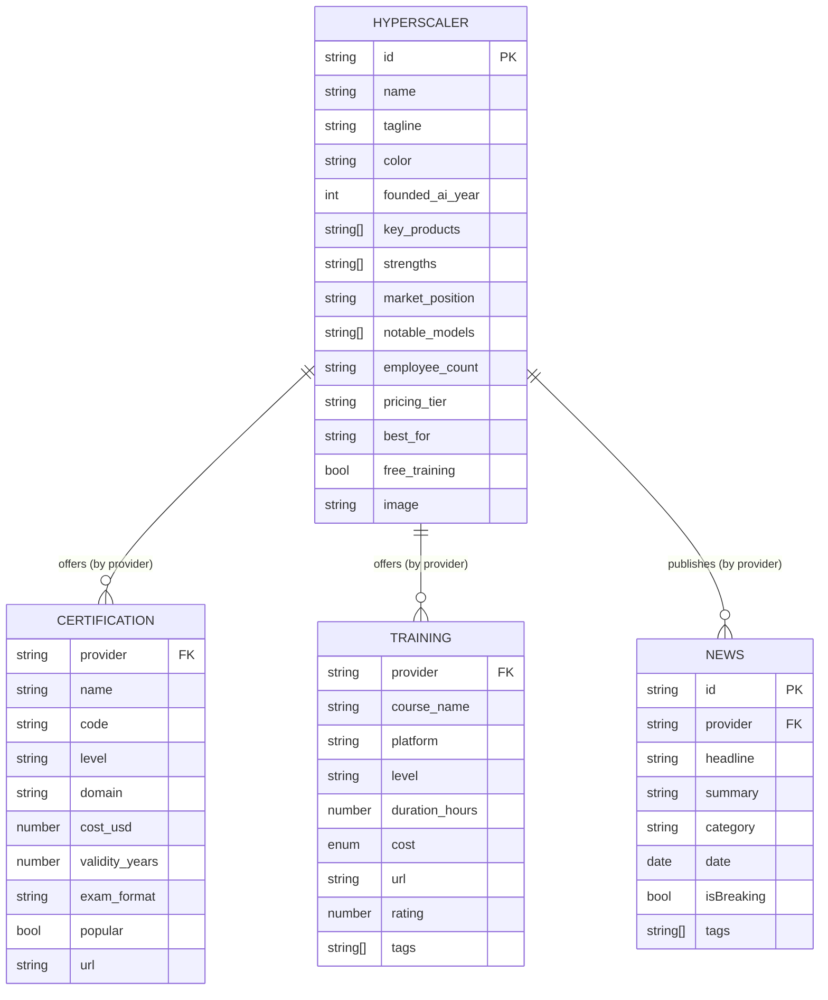

> The relationship is **logical**, resolved by string-matching `provider` to a hyperscaler `id` (via `providerToId`). There is no relational database — the "join" happens in memory at build time.

---

## 7. Key sequence flows

### 7.1 Page request (production)
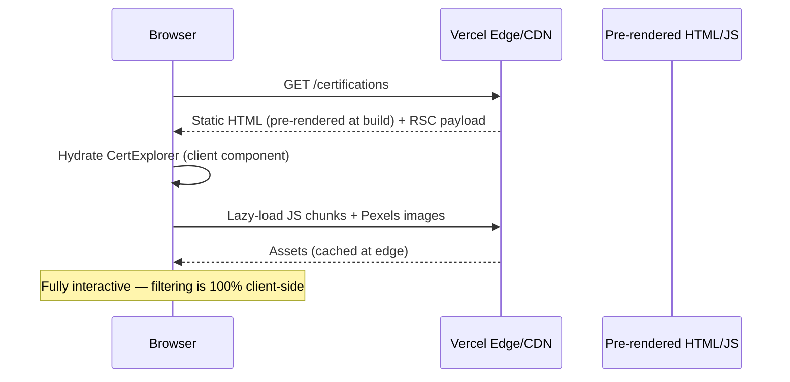

### 7.2 Build-time data baking
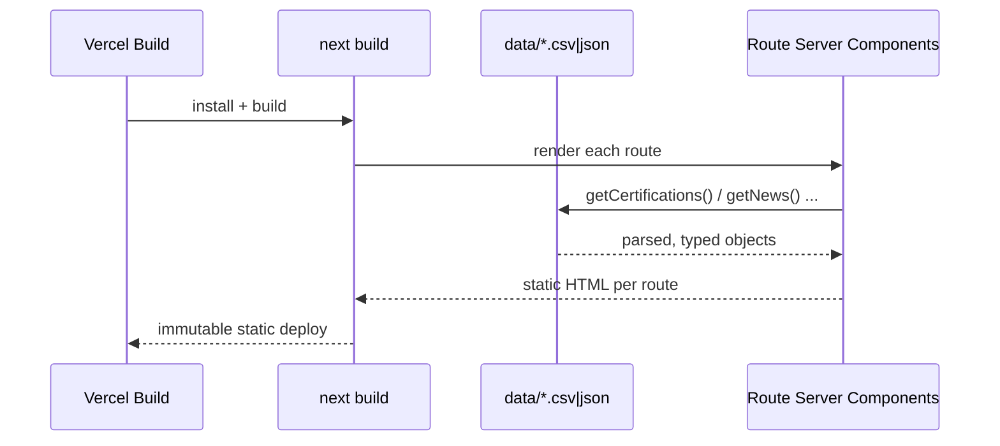

### 7.3 Client-side filter interaction
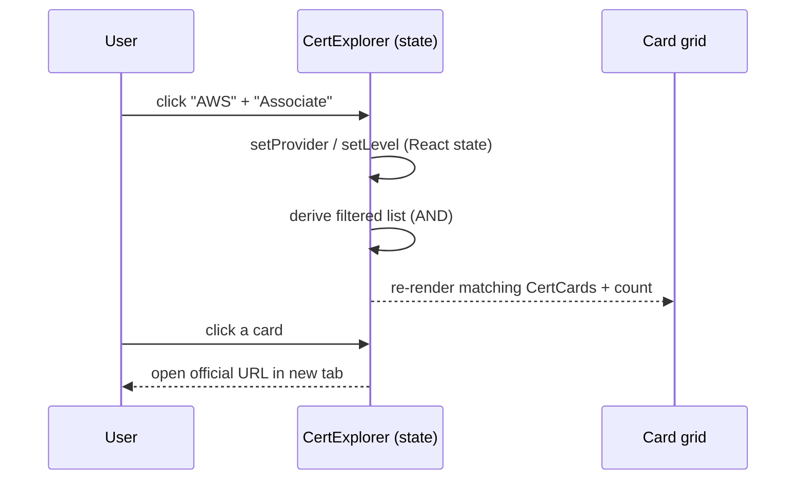

---

## 8. Solution mapping — requirements traceability

Maps Functional Spec requirements → implementing artefacts.

| FR area | Requirement(s) | Implemented by |
|---|---|---|
| Global nav & active state | FR-G1–G3 | `components/Navbar.tsx` |
| Footer | FR-G4 | `components/Footer.tsx` |
| Page transitions | FR-G5 | `components/PageTransition.tsx` |
| Dark theme / typography | FR-G6, FR-G7 | `app/globals.css`, `tailwind.config.ts`, `app/layout.tsx` |
| Reduced motion | FR-G9 | `app/globals.css` (`@media prefers-reduced-motion`) |
| Hero + headline | FR-H1 | `app/page.tsx` |
| Ambient glow | FR-H2 | `components/AmbientGlow.tsx` |
| Command Deck (live tiles + ticker) | FR-H3–H5 | `components/CommandDeck.tsx` (data shaped in `app/page.tsx`) |
| Count-up stats | FR-H6 | `components/CountUp.tsx` |
| Hyperscaler cards | FR-H7 | `components/HyperscalerCard.tsx` |
| Featured news / top certs | FR-H8, FR-H9 | `app/page.tsx` + `NewsCard` / `CertCard` |
| Home CTA | FR-H10 | `app/page.tsx` |
| Hyperscaler tabs + deep-link | FR-Y1–Y6 | `app/hyperscalers/page.tsx`, `components/HyperscalerTabs.tsx` |
| Certifications filter grid | FR-C1–C8 | `app/certifications/page.tsx`, `components/CertExplorer.tsx`, `components/CertCard.tsx` |
| Training filter grid | FR-T1–T5 | `app/training/page.tsx`, `components/TrainingExplorer.tsx` |
| News filter grid + breaking | FR-N1–N6 | `app/news/page.tsx`, `components/NewsExplorer.tsx`, `components/NewsCard.tsx` |
| Compare table | FR-P1–P8 | `app/compare/page.tsx`, `components/CompareTable.tsx` |
| Data access & rules | DR1–DR4 | `lib/data.ts`, `lib/types.ts`, `lib/brand.ts` |
| Brand colours / accent | BR1 | `lib/brand.ts`, `tailwind.config.ts` |
| Outbound link safety | BR5 | `CertCard`, `TrainingExplorer` (`target=_blank rel=noopener`) |
| Design enforcement | BR6, G6 | `.claude/agents/design-enforcer.md`, `docs/design/style-guide.md` |
| SEO metadata | NFR4 | `metadata` exports per route |
| Image optimisation | NFR1 | `next/image` + `next.config.js` remotePatterns |

---

## 9. Design system mapping

The dark "Bloomberg-Terminal-meets-Apple-Keynote" language is codified as tokens and reused everywhere.

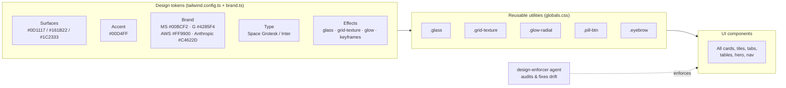

| Token group | Source | Consumed by |
|---|---|---|
| Colour scale + brand | `tailwind.config.ts`, `lib/brand.ts` | every component (classes + inline brand colour) |
| Typography | `app/layout.tsx` (next/font) → CSS vars → Tailwind `font-heading`/`font-body` | all text |
| Surfaces & effects | `app/globals.css` (`.glass`, `.grid-texture`, `.glow-radial`) | cards, hero, sections |
| Motion | `tailwind.config.ts` keyframes + Framer Motion | CommandDeck, Reveal, PageTransition, badges |

---

## 10. Cross-cutting concerns

| Concern | Approach |
|---|---|
| **Performance** | SSG + edge CDN; code-split client islands; `next/image` lazy loading; ~87 kB shared JS. |
| **Accessibility** | Semantic `header`/`nav`/`main`/`footer`; `aria-label` on icon buttons; keyboard-focusable links; reduced-motion guard; AA-oriented contrast. |
| **SEO** | Title template + per-route metadata; static HTML is fully crawlable. |
| **Security** | No secrets/env; static output; outbound links use `rel="noopener noreferrer"`; restricted image `remotePatterns`. |
| **Maintainability** | Content via data files; typed contracts; pure helpers isolated from `fs` access. |
| **Observability** | Vercel build & deployment logs; Vercel Analytics available as a future toggle. |

---

## 11. CI/CD & environments

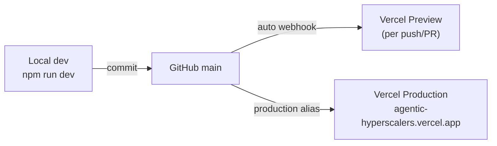

| Environment | Trigger | URL |
|---|---|---|
| Local | `npm run dev` | http://localhost:3000 |
| Preview | every push / PR | Vercel-generated preview URL |
| Production | push to `main` | https://agentic-hyperscalers.vercel.app |

> **Build note:** behind a TLS-intercepting corporate proxy, local `next build` may need `NODE_TLS_REJECT_UNAUTHORIZED=0` so `next/font` can fetch Google Fonts at build time. This is a **local-only** workaround; Vercel's build environment is unaffected and never uses it.

---

## 12. Decision log (ADRs, abridged)

| # | Decision | Rationale | Alternatives considered |
|---|---|---|---|
| ADR-1 | Next.js App Router + SSG | Best fit for static, content-driven, Vercel-hosted portal | Pure SPA, plain static site generator |
| ADR-2 | CSV/JSON files as content store | Versioned, reviewable, zero infra; matches the lesson brief | Headless CMS, database |
| ADR-3 | Tailwind v3 (not v4) | Predictable, stable utility behaviour at build time | Tailwind v4 (scaffolded default) |
| ADR-4 | Remote Pexels images | Works immediately on Vercel; no download/optimise step | Download + WebP to `public/` |
| ADR-5 | `providerToId` in `brand.ts`, not `data.ts` | Keeps `node:fs` out of client bundles | Re-export from data only |
| ADR-6 | Inline brand colours via JS | Dynamic per-provider colours can't be static Tailwind classes | Safelisting many colour classes |

---

## 13. Repository structure

```
agentic-hyperscalers/
├─ app/                     # routes (Server Components) + layout + globals
│  ├─ layout.tsx            # fonts, Navbar, Footer, PageTransition
│  ├─ page.tsx              # Homepage
│  ├─ hyperscalers/page.tsx
│  ├─ certifications/page.tsx
│  ├─ training/page.tsx
│  ├─ news/page.tsx
│  └─ compare/page.tsx
├─ components/              # Client + presentational components
├─ lib/                     # data.ts (server) · types.ts · brand.ts (pure)
├─ data/                    # certifications.csv · training.csv · *.json
├─ docs/                    # this document, FSD, design system
│  └─ design/               # style-guide.md + references/
├─ .claude/agents/          # design-enforcer sub-agent
├─ next.config.js · tailwind.config.ts · tsconfig.json
└─ package.json
```

---

*End of document.*
